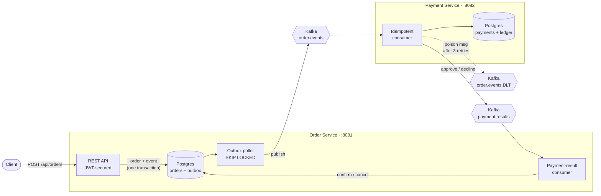
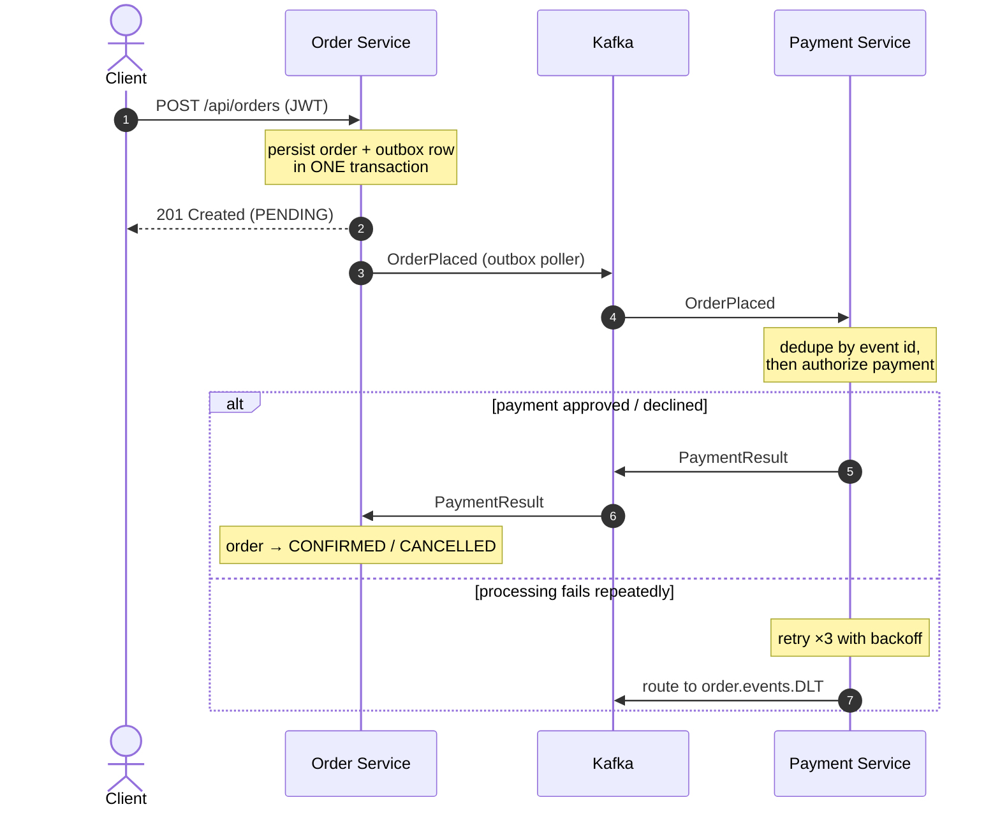

# Order & Payment Processing System

An event-driven microservices system that processes orders and payments with **crash-safe, at-least-once event delivery** between services. Built to demonstrate the distributed-systems patterns that keep money-moving workflows correct under failure.

> **Status: implemented.** Both services, the transactional outbox relay, the choreography saga, idempotent consumption, dead-lettering, JWT-secured APIs, Testcontainers integration tests, Docker Compose, and CI are in place. Run it with one command (below).

## Why this project

Order/payment flows have a classic hard problem: when a service commits to its database *and* must publish an event (e.g. "order placed" → charge payment), a crash between the two leaves the system inconsistent (the **dual-write problem**). This project solves that properly rather than hand-waving it.

## Architecture



**Happy path and the failure path, as a sequence:**



- **Order Service** — accepts orders over JWT-secured REST APIs, persists them, and writes an `OrderPlaced` event to a **transactional outbox** in the *same* DB transaction (no dual write). Consumes `payment.results` to confirm/cancel.
- **Outbox poller** — a scheduled relay that claims committed outbox rows (row lock + `SKIP LOCKED`), publishes them to Kafka after a broker ack, and marks them published — **at-least-once** delivery.
- **Payment Service** — consumes order events **idempotently** (dedupe by event id in a Postgres ledger), simulates payment, emits `payment.results`.
- **Choreography saga** — `order → payment → confirmation` with no central orchestrator; each service reacts to events.
- **Reliability** — retry with backoff, **dead-letter topic** for poison messages, correlation-ID tracing across the async hops.

## Patterns demonstrated

| Concern | Approach | Where |
|---|---|---|
| Dual-write consistency | Transactional Outbox | `order-service` `OrderService`, `OutboxPoller` |
| Duplicate delivery | Idempotent consumers (event-id ledger) | `payment-service` `PaymentProcessor`, `order-service` `PaymentResultListener` |
| Distributed workflow | Choreography saga | both services via Kafka |
| Poison messages | Retry + dead-letter topic | `payment-service` `KafkaConsumerConfig` |
| Security | JWT resource server + bean validation | `order-service` `SecurityConfig` |
| Observability | Correlation-ID tracing, Actuator + Prometheus metrics | `CorrelationIdFilter`, record interceptors |
| Correctness proof | Testcontainers integration tests (incl. crash-recovery) | `*/src/test` |

## Tech stack

Java 21 · Spring Boot 3.3 · Apache Kafka · PostgreSQL · Flyway · Docker Compose · Testcontainers · JUnit 5

## Module layout

```
order-payment-system
├── common            # shared event contracts (OrderPlaced, PaymentResult), topic names, headers
├── order-service     # REST + outbox producer + saga completion    (port 8081)
├── payment-service   # idempotent consumer + DLT + result producer  (port 8082)
├── docker-compose.yml
└── .github/workflows/ci.yml
```

## Running locally

Everything, one command (requires Docker):

```bash
docker compose up --build
```

This starts Postgres, Kafka (KRaft, no ZooKeeper), and both services. Flyway creates the schemas on startup.

### Try it end to end

```bash
# 1. Mint a dev JWT (dev-only helper endpoint)
TOKEN=$(curl -s -X POST "http://localhost:8081/api/dev/token" | sed -E 's/.*"access_token":"([^"]+)".*/\1/')

# 2. Place an order
ORDER=$(curl -s -X POST http://localhost:8081/api/orders \
  -H "Authorization: Bearer $TOKEN" -H "Content-Type: application/json" \
  -d '{"customerId":"cust-1","amount":99.00,"currency":"USD"}')
echo "$ORDER"
ORDER_ID=$(echo "$ORDER" | sed -E 's/.*"id":"([^"]+)".*/\1/')

# 3. Poll the order — status transitions PENDING -> CONFIRMED once payment completes
curl -s -H "Authorization: Bearer $TOKEN" "http://localhost:8081/api/orders/$ORDER_ID"
```

Interesting inputs to demo behaviour:
- `amount` > `10000.00` → payment **declined**, order ends **CANCELLED**.
- `amount` = `6.66` → simulated gateway failure → retried 3× → routed to the **`order.events.DLT`** dead-letter topic.

## Tests

Integration tests use Testcontainers (real Postgres + Kafka), so **Docker must be running**:

```bash
./mvnw verify
```

Coverage includes: outbox → Kafka relay, crash-recovery (an unpublished row committed before a crash is relayed on restart), idempotent double-delivery (charged once), and poison-message dead-lettering.

## Deliberate simplifications

These keep the project runnable on a laptop without weakening the patterns it demonstrates; each has a clear production upgrade path:

- **Auth** uses an HS256 shared secret with a dev token-minting endpoint instead of a full OIDC provider. The resource-server filter chain is real; swap the decoder for a JWK-set URL in production and drop `DevTokenController`.
- **Payment** is simulated (approve under a limit) rather than calling a real gateway.
- **Kafka/Postgres** run single-node; replication factors are 1.
